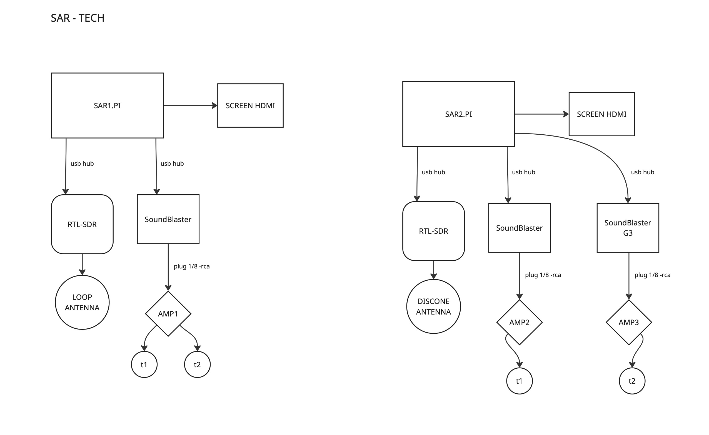

# S.A.R — Raspberry Pi 5 Setup Guide



Complete setup instructions for running the S.A.R system on a Raspberry Pi 5 (8 GB RAM).

---

## Hardware Requirements

| Component | Pi 1 | Pi 2 | Notes |
|-----------|------|------|-------|
| Raspberry Pi 5 | 8 GB RAM | 8 GB RAM | Pi 4 with 4+ GB may work but is untested |
| USB sound card | Play! 3 | Play! 3 + G3 | Pi 2 uses G3 for SuperCollider |
| RTL-SDR dongle | Yes | Yes | RTL-SDR Blog V3/V4 |
| Antenna | Discone | HF loop | Set in per-Pi autostart script |
| Synth | Drone | Resonator | Set in per-Pi autostart script |
| Display | HDMI | GUI requires a display (not headless) |
| Internet | Yes | Sensor APIs require network access |
| SD card | 32 GB+ | ~200 MB for app + tiles + database |

---

## Step 1 — System Packages

Heavy Python libraries (PyQt5, numpy, scipy) cannot be compiled on Pi — install via apt:

```bash
sudo apt update
sudo apt install -y \
    python3-pyqt5 python3-pyqtgraph python3-numpy \
    python3-scipy python3-pil python3-matplotlib \
    supercollider sc3-plugins jackd2 git
```

When prompted about **real-time priority for JACK**, select **Yes**.

---

## Step 2 — Increase Swap

The system uses ~700 MB RAM at peak. A 2 GB swap provides a safety net during startup:

```bash
sudo sed -i 's/CONF_SWAPSIZE=.*/CONF_SWAPSIZE=2048/' /etc/dphys-swapfile
sudo dphys-swapfile setup
sudo dphys-swapfile swapon
```

Verify:

```bash
free -h
```

---

## Step 3 — Audio Group

Add your user to the `audio` group for real-time thread priority (required by JACK and the audio playback thread):

```bash
sudo usermod -a -G audio $USER
```

**Reboot** for the group change to take effect:

```bash
sudo reboot
```

---

## Step 4 — Audio Setup (PipeWire + USB Sound Cards)

Raspberry Pi 5 has **no 3.5mm audio jack**. Audio routes through USB sound cards via PipeWire (the default audio server on Raspberry Pi OS Bookworm). Pi 1 uses a single Play! 3 for everything. Pi 2 uses a Play! 3 for SDR audio and a G3 for SuperCollider (routed automatically by the autostart script).

### 4.1 — Install PipeWire ALSA and JACK layers

```bash
sudo apt install -y pipewire-alsa pipewire-jack
```

### 4.2 — Restart PipeWire

```bash
systemctl --user restart pipewire wireplumber
```

### 4.3 — Verify the USB sound card is detected

```bash
cat /proc/asound/cards
```

You should see your USB card listed, e.g.:

```
 0 [vc4hdmi0       ]: vc4-hdmi - vc4-hdmi-0
 1 [vc4hdmi1       ]: vc4-hdmi - vc4-hdmi-1
 2 [S3             ]: USB-Audio - Sound Blaster Play! 3
```

### 4.4 — Set the USB card as default output

Check PipeWire sinks:

```bash
wpctl status
```

Look under **Audio → Sinks** for your USB card and note its ID number. Then:

```bash
wpctl set-default <SINK_ID>
wpctl set-volume <SINK_ID> 1.0
```

Replace `<SINK_ID>` with the number (e.g. `70`).

### 4.5 — Test audio output

```bash
speaker-test -c 2 -t wav
```

You should hear "Front Left", "Front Right" from the USB card. Press `Ctrl+C` to stop.

### How it works

**Pi 1 (single card):**
- **SDR audio** → sounddevice → PipeWire → Play! 3
- **SuperCollider** → scsynth → PipeWire JACK layer → Play! 3
- PipeWire mixes both streams to the single USB output

**Pi 2 (dual cards):**
- **SDR audio** → sounddevice → PipeWire → Play! 3 (default sink)
- **SuperCollider** → scsynth → PipeWire JACK → G3 (routed by `sar_autostart_pi2.sh` via `pw-link`)
- Autostart explicitly sets Play! 3 as default sink and both cards to full volume
- Each audio path has a dedicated sound card — no mixing conflicts

> **Note:** `pw-link -d` requires exact port names (no wildcards). The autostart script discovers the Play! 3 port name dynamically via `pw-link -i` before disconnecting.

> **Note (Pi 4):** If your Pi has a 3.5mm jack, SDR audio routes there automatically and SuperCollider uses the USB card via JACK — no PipeWire configuration needed.

---

## Step 5 — Clone the Repository

```bash
cd ~
git clone https://github.com/Lessnullvoid/SAR_system.git
cd SAR_system
```

If the repository is private, use a personal access token:

```bash
git clone https://<YOUR_TOKEN>@github.com/Lessnullvoid/SAR_system.git
```

---

## Step 6 — Python Virtual Environment

Create a virtual environment that inherits system-installed packages (PyQt5, numpy, scipy):

```bash
python3 -m venv --system-site-packages .venv
source .venv/bin/activate
```

Install the remaining Python dependencies:

```bash
pip install pyrtlsdr sounddevice scikit-learn shapely pyproj requests python-osc
```

The `--system-site-packages` flag lets pip packages coexist with apt-installed ones. Without it, PyQt5 and numpy would need to be compiled from source (which fails on Pi).

---

## Step 7 — First Run

```bash
cd ~/SAR_system
source .venv/bin/activate
python -m python_app.gui_main
```

The application starts in **fullscreen**. Press **F** to toggle fullscreen mode.

### Download satellite tiles

On first run, the map will show only the fault corridor grid. Click the **Satellite** button in the top-right corner of the map panel to download imagery tiles (~100 MB). This takes a few minutes on the first run. Tiles are cached in `data/sat_cache/` for subsequent launches.

### What starts automatically

1. **Map tiles** load first (~10 seconds)
2. **SDR radio** starts after tiles are loaded (connects to RTL-SDR dongle)
3. **ML radio scanner** starts 5 seconds after SDR connects
4. **Map scanner** starts 8 seconds after tiles load
5. **SuperCollider drone** starts 10 seconds after SDR, launched via `pw-jack`

If the RTL-SDR dongle is not connected, the system still runs with map, sensors, and SuperCollider — the SDR panel will show "SDR offline".

---

## Updating

Pull the latest code:

```bash
cd ~/SAR_system
git pull
```

If satellite tiles need to be re-downloaded (e.g. resolution change):

```bash
rm ~/SAR_system/data/sat_cache/SAF_*.png
```

Then restart the app and click **Satellite** again.

---

## Troubleshooting

### No audio from SuperCollider

Check if scsynth is running:

```bash
pgrep -a scsynth
```

If not, check if PipeWire JACK is working:

```bash
pw-jack jack_lsp
```

If no JACK ports appear, ensure `pipewire-jack` is installed and PipeWire is running:

```bash
sudo apt install pipewire-jack
systemctl --user restart pipewire wireplumber
```

### No audio from SDR

Check that the USB card is the default PipeWire sink:

```bash
wpctl status
```

The `*` should be next to your USB card under Sinks. If not:

```bash
wpctl set-default <SINK_ID>
```

### SSH display error

The GUI requires a display. If connecting via SSH:

```bash
# Option 1: run directly on the Pi desktop terminal
# Option 2: forward display over SSH
ssh -X user@pi.local
export DISPLAY=:0
python -m python_app.gui_main
```

For best results, run directly on the Pi's desktop.

### Application killed (OOM)

If the app is killed by the system, check memory:

```bash
dmesg | tail -20
free -h
```

Ensure swap is configured (Step 2) and you're using a Pi 5 with 8 GB.

### SSH host key changed

If you reinstalled the OS on the Pi:

```bash
ssh-keygen -R <pi_hostname>.local
ssh user@<pi_hostname>.local
```

---

## Monitoring

### Resource usage

```bash
# Quick snapshot (RSS = physical RAM)
ps aux | grep python

# Live monitoring
top -p $(pgrep -f "python_app.gui_main")

# Detailed memory
pgrep -f "python_app.gui_main" | xargs -I{} cat /proc/{}/status | grep -E "VmRSS|VmSwap"

# System-wide
free -h
```

### Typical resource usage

| Metric | Value |
|--------|-------|
| RAM (RES) | ~700 MB |
| CPU | ~50% of one core |
| Free RAM (8 GB Pi) | ~5.5 GB |
| Swap used | < 200 MB |

### PipeWire audio status

```bash
# List all sinks and sources
wpctl status

# List JACK ports (SDR + SuperCollider)
pw-jack jack_lsp

# Check PipeWire service
systemctl --user status pipewire wireplumber
```

---

## Auto-Start on Boot

SAR can launch automatically when the Pi desktop loads. A dispatcher script
(`sar_autostart.sh`) detects which Pi is running by checking for the G3 sound
card via `lsusb`, then delegates to the correct per-Pi script:

| Script | Pi | Antenna | Synth | Sound cards | SC routing |
|--------|-------|---------|-------|-------------|------------|
| `sar_autostart_pi1.sh` | Pi 1 | `discone` | `drone` | Play! 3 | shared card |
| `sar_autostart_pi2.sh` | Pi 2 | `loop_antenna` | `resonator` | Play! 3 + G3 | Play! 3 default + `pw-link` SC to G3 + both at 100% vol |

### Install autostart (same step on both Pis)

```bash
cd ~/SAR_system && git pull
chmod +x ~/SAR_system/scripts/sar_autostart*.sh
mkdir -p ~/.config/autostart
cp ~/SAR_system/scripts/sar.desktop ~/.config/autostart/
```

Reboot to test:

```bash
sudo reboot
```

SAR will start in fullscreen once the desktop is ready. Logs are written to `/tmp/sar.log`.

On Pi 2, the log will show `scsynth routed to G3` once SuperCollider's JACK
ports are connected to the G3 sound card.

### Disable autostart

```bash
rm ~/.config/autostart/sar.desktop
```

### Changing per-Pi configuration

Edit the corresponding script directly:

```bash
# Pi 1
nano ~/SAR_system/scripts/sar_autostart_pi1.sh

# Pi 2
nano ~/SAR_system/scripts/sar_autostart_pi2.sh
```

---

## Pi-Specific Optimizations

The system automatically detects Raspberry Pi and applies these optimizations:

- **Satellite tiles**: downloaded at 256px (vs 512px desktop) with smooth rendering
- **Dark GUI**: global black stylesheet overrides the Pi desktop theme
- **Audio routing**: PipeWire mixing on Pi 5, BCM2835 jack on Pi 4. Pi 2 auto-routes SuperCollider to G3 via `pw-link`
- **SuperCollider**: launched via `pw-jack` for PipeWire JACK compatibility
- **Deferred startup**: SuperCollider starts 10s after map + SDR stabilize
- **Batched tile loading**: prevents GIL starvation of the audio pipeline
- **Staggered sensor polling**: spreads network and CPU load over time
- **Per-Pi autostart**: hardware detection dispatches to the correct config script
